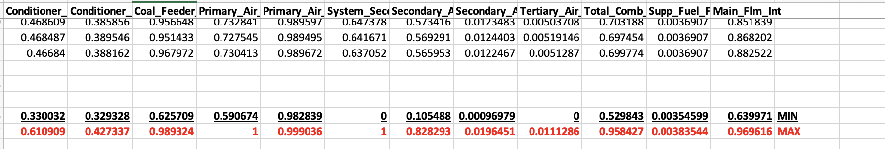

# Meeting Summary

**Meeting Date:** November 20th, 2023  
**Participants:** Travis Dessel, Rohaan Nadeem  

## Discussion Points

- **Progress on Project:** 
  - Reviewed the current status of the project.
  
- **Way Forward:**
  - Discussed strategies and plans for the future development of the project.

- **Constructive Criticism:**
  - Noted that data should be split across time and not across stocks.
  - Emphasized the need for data normalization.

## Action Items

- [ ] **Normalize Data - 0-1**
- [ ] **Normalize Date - Z-Score**
- [ ] **Research Data Preprocessing**
- [ ] **Contact Authors of a Research Paper**
- [ ] **N-1 Prediction**
- [ ] **List of Activation Functions**
- [ ] **Incorporate Cyclical Date - Cosine**
- [ ] **Incorporate Cyclical Date - 1 - Hot Encoding**

## Next Steps

- Initiate the normalization process for data.
- Explore and implement Z-Score normalization for date values.
- Research various data preprocessing techniques.
- Contact authors of a relevant research paper for insights.
- Work on N-1 prediction model.
- Compile a list of activation functions suitable for the project.
- Implement cyclical date encoding using cosine.
- Explore and implement 1-Hot Encoding for cyclical date representation.

## Progress

- Realized burner dataset is 0-1 realized:


## Commands

### Experiment 1a
```
./multithreaded/examm_mt --number_threads 4 --training_filenames ../datasets/stock/nyse/ibm_training.csv --test_filenames ../datasets/stock/nyse/ibm_test.csv --time_offset 1 --input_parameter_names date open volume close --output_parameter_names close --number_islands 10 --population_size 10 --max_genomes 2000 --bp_iterations 10 --output_directory ./experiment_outputs/1a --possible_node_types simple UGRNN MGU GRU delta LSTM --std_message_level INFO --file_message_level INFO --island_size 5
```

### Experiment 1b
```
./multithreaded/examm_mt --number_threads 4 --training_filenames ../datasets/stock/nyse/ibm_training.csv --test_filenames ../datasets/stock/nyse/ibm_test.csv --time_offset 1 --input_parameter_names date season open volume close --output_parameter_names close --number_islands 10 --population_size 10 --max_genomes 2000 --bp_iterations 10 --output_directory ./experiment_outputs/1b --possible_node_types simple UGRNN MGU GRU delta LSTM --std_message_level INFO --file_message_level INFO --island_size 5
```

### Experiment 1c
```
./multithreaded/examm_mt --number_threads 4 --training_filenames ../datasets/stock/nyse/ibm_training.csv --test_filenames ../datasets/stock/nyse/ibm_test.csv --time_offset 1 --input_parameter_names date season open close --output_parameter_names close --number_islands 10 --population_size 10 --max_genomes 2000 --bp_iterations 10 --output_directory ./experiment_outputs/1c --possible_node_types simple UGRNN MGU GRU delta LSTM --std_message_level INFO --file_message_level INFO --island_size 5
```

### Experiment 1d
```
./multithreaded/examm_mt --number_threads 4 --training_filenames ../datasets/stock/nyse/ibm_training.csv --test_filenames ../datasets/stock/nyse/ibm_test.csv --time_offset 1 --input_parameter_names date open close --output_parameter_names close --number_islands 10 --population_size 10 --max_genomes 2000 --bp_iterations 10 --output_directory ./experiment_outputs/1d --possible_node_types simple UGRNN MGU GRU delta LSTM --std_message_level INFO --file_message_level INFO --island_size 5
```

### Experiment 2
```
./multithreaded/examm_mt --number_threads 4 --training_filenames ../datasets/stock/nyse/ibm_training_2.csv --test_filenames ../datasets/stock/nyse/ibm_test.csv --time_offset 1 --input_parameter_names date open close --output_parameter_names close --number_islands 10 --population_size 10 --max_genomes 2000 --bp_iterations 10 --output_directory ./experiment_outputs/2 --possible_node_types simple UGRNN MGU GRU delta LSTM --std_message_level INFO --file_message_level INFO --island_size 5
```

### Experiment 3
```
./multithreaded/examm_mt --number_threads 4 --training_filenames ../datasets/stock/nyse/ibm_training_3.csv --test_filenames ../datasets/stock/nyse/ibm_test.csv --time_offset 1 --input_parameter_names date open close --output_parameter_names close --number_islands 10 --population_size 10 --max_genomes 2000 --bp_iterations 10 --output_directory ./experiment_outputs/3 --possible_node_types simple UGRNN MGU GRU delta LSTM --std_message_level INFO --file_message_level INFO --island_size 5
```

### Experiment 4
```
./multithreaded/examm_mt --number_threads 4 --training_filenames ../datasets/stock/nyse/5_defensive_stocks_training.csv --test_filenames ../datasets/stock/nyse/5_defensive_stocks_test.csv --time_offset 1 --input_parameter_names stock date open close --output_parameter_names close --number_islands 10 --population_size 10 --max_genomes 2000 --bp_iterations 10 --output_directory ./experiment_outputs/4 --possible_node_types simple UGRNN MGU GRU delta LSTM --std_message_level INFO --file_message_level INFO --island_size 5
```

### Experiment 5
```
./multithreaded/examm_mt --number_threads 4 --training_filenames ../datasets/stock/nyse/5_defensive_stocks_training_2.csv --test_filenames ../datasets/stock/nyse/5_defensive_stocks_test_2.csv --time_offset 1 --input_parameter_names date open close aep emr ibm jnj pg --output_parameter_names close --number_islands 10 --population_size 10 --max_genomes 2000 --bp_iterations 10 --output_directory ./experiment_outputs/5 --possible_node_types simple UGRNN MGU GRU delta LSTM --std_message_level INFO --file_message_level INFO --island_size 5
```