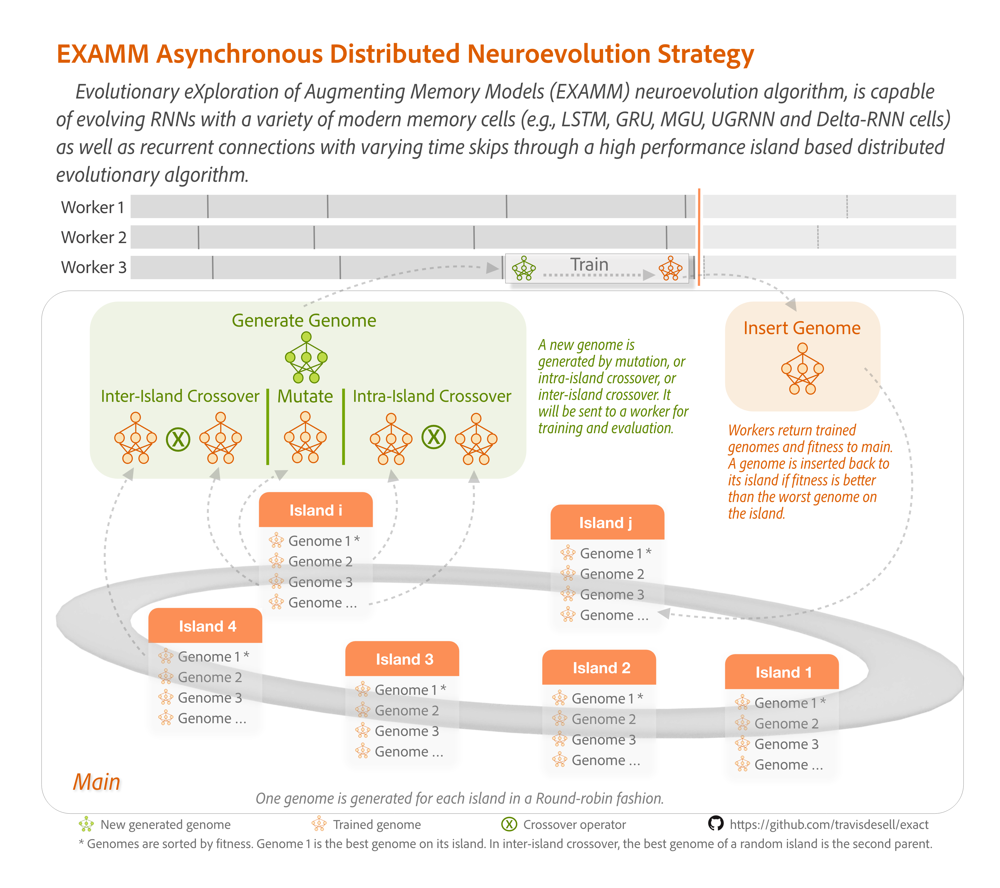
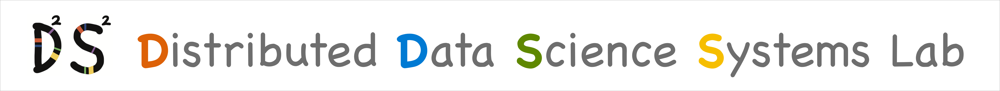

<div style="float: right">
    
</div>

# EXAMM: Evolutionary eXploration of Augmenting Memory Models

EXAMM (Evolutionary eXploration of Augmenting Memory Models) is a neuroevolution-based neural architecture search algorithm designed for time series forecasting. Through evolutionary processes including natural selection, mutations, and crossovers, EXAMM evolves both the structure and weights of Recurrent Neural Networks (RNNs). The algorithm is capable of incorporating various modern memory cells (LSTM, GRU, MGU, UGRNN, and Delta-RNN) and can establish recurrent connections with varying time skips through a high-performance island-based distributed evolutionary algorithm.

Implemented in C++, EXAMM is designed for CPU-based computation and offers excellent scalability - from personal laptops to high-performance computing clusters. The system employs a distributed architecture where worker processes handle RNN training while a main process manages population evolution and orchestrates the overall evolutionary process.



# Selected Publications

EXAMM has been at the forefront of neuroevolution research, making significant contributions to both algorithmic advancement and real-world applications. Our work spans multiple domains including financial forecasting, industrial production system management, and algorithm optimization. Through continuous development and innovation, we've published extensively on improving neuroevolution techniques, enhancing RNN architectures, and solving complex time series forecasting challenges. Our ongoing research continues to push the boundaries of what's possible with evolutionary neural architecture search. 

1. Zimeng Lyu, Devroop Kar, Matthew Simoni, Rohaan Nadeem, Avinash Bhojanapalli, Hao Zhang and Travis Desell. **[Evolving RNNs for Stock Forecasting: A Low Parameter Efficient Alternative to Transformers](link).** *The 28th International Conference on the Applications of Evolutionary Computation (EvoStar: EvoApps 2025).* Trieste, Italy. April 23-25, 2025.

2. Devroop Kar, Zimeng Lyu, Alexander G. Ororibia, Travis Desell, and Daniel Krutz. **[Enabling An Informed Contextual Multi-Armed Bandit Framework For Stock Trading With Neuroevolution](link).** *Proceedings of the Genetic and Evolutionary Computation Conference Companion.* Melbourne, Australia. July 14-18, 2024.

3. Jared Murphy, Devroop Kar, Joshua Karns, and Travis Desell. **[EXA-GP: Unifying Graph-Based Genetic Programming and Neuroevolution for Explainable Time Series Forecasting](link).** *Proceedings of the Genetic and Evolutionary Computation Conference Companion.* Melbourne, Australia. July 14-18, 2024.

4. Jared Murphy, Travis Desell. **[Minimizing the EXA-GP Graph-Based Genetic Programming Algorithm for Interpretable Time Series Forecasting](link).** *Proceedings of the Genetic and Evolutionary Computation Conference Companion.* Melbourne, Australia. July 14-18, 2024.

5. Zimeng Lyu, Amulya Saxena, Rohaan Nadeem, Hao Zhang, Travis Desell. **[Neuroevolution Neural Architecture Search for Evolving RNNs in Stock Return Prediction and Portfolio Trading](link).** *arXiv.* 2024.

6. Aditya Shankar Thakur, Akshar Bajrang Awari, Zimeng Lyu, and Travis Desell. **[Efficient Neuroevolution using Island Repopulation and Simplex Hyperparameter Optimization](link).** *The 2023 IEEE Symposium Series on Computational Intelligence (SSCI 2023).* Mexico City, Mexico. December 5-8, 2023.

7. Amit Dilip Kini*, Swaraj Sambhaji Yadav*, Aditya Shankar Thakur, Akshar Bajrang Awari, Zimeng Lyu, and Travis Desell. **[Co-evolving Recurrent Neural Networks and their Hyperparameters with Simplex Hyperparameter Optimization](link).** *The Genetic and Evolutionary Computation Conference Companion (GECCO '23 Companion).* Lisbon, Portugal. July 15–19, 2023. *Indicates equal contribution.

8. Joshua Karns and Travis Desell. **[Local Stochastic Differentiable Architecture Search for Memetic Neuroevolution Algorithms](link).** *The Genetic and Evolutionary Computation Conference Companion (GECCO '23 Companion).* Lisbon, Portugal. July 15–19, 2023.

9. Michael Kogan, Joshua Karns and Travis Desell. **[Self-Adaptation of Neuroevolution Algorithms using Reinforcement Learning](link).** *The 25th International Conference on the Applications of Evolutionary Computation (EvoStar: EvoApps 2021).* Madrid, Spain. April 20-22, 2022.

10. Zimeng Lyu, Shuchita Patwardhan, David Stadem, James Langfeld, Steve Benson, Travis Desell. **[Neuroevolution of Recurrent Neural Networks for Time Series Forecasting of Coal-Fired Power Plant Data](link).** *The Genetic and Evolutionary Computation Conference (GECCO 2021).*

11. Joshua Karns and Travis Desell. **[Improving the Scalability of Distributed Neuroevolution Using Modular Congruence Class Generated Innovation Numbers](link).** *The 1st Workshop on Evolutionary Algorithms and High Performance Computing (EAHPC), held in conjunction with ACM Genetic and Evolutionary Computation Conference (GECCO).* Lille, France. July 10-14, 2021.

12. Zimeng Lyu, AbdElRahman ElSaid, Joshua Karns, Mohamed Mkaouer, Travis Desell. **[An Experimental Study of Weight Initialization and Lamarckian Inheritance on Neuroevolution](link).** *The 24th International Conference on the Applications of Evolutionary Computation (EvoStar: EvoApps 2021).*

13. Zimeng Lyu, Joshua Karns, AbdElRahman ElSaid, Mohamed Mkaouer, Travis Desell. **[Improving Distributed Neuroevolution Using Island Extinction and Repopulation](link).** *The 24th International Conference on the Applications of Evolutionary Computation (EvoStar: EvoApps 2021).*

14. AbdElRahman ElSaid, Joshua Karns, Zimeng Lyu, Daniel Krutz, Alexander Ororbia, Travis Desell. **[Improving Neuroevolutionary Transfer Learning of Deep Recurrent Neural Networks through Network-Aware Adaptation](link).** *The Genetic and Evolutionary Computation Conference (GECCO 2020).*

15. AbdElRahman ElSaid, Joshua Karns, Zimeng Lyu, Daniel Krutz, Alexander G. Ororbia, Travis Desell. **[Neuro-Evolutionary Transfer Learning through Structural Adaptation](link).** *The 23rd International Conference on the Applications of Evolutionary Computation (EvoStar: EvoApps 2020).*

16. Alex Ororbia, AbdElRahman ElSaid, and Travis Desell. **[Investigating Recurrent Neural Network Memory Structures using Neuro-Evolution](https://dl.acm.org/citation.cfm?id=3321795).** *The Genetic and Evolutionary Computation Conference (GECCO 2019).* Prague, Czech Republic. July 8-12, 2019.

17. AbdElRahman ElSaid, Steven Benson, Shuchita Patwardhan, David Stadem and Travis Desell. **[Evolving Recurrent Neural Networks for Time Series Data Prediction of Coal Plant Parameters](https://link.springer.com/chapter/10.1007/978-3-030-16692-2_33).** *The 22nd International Conference on the Applications of Evolutionary Computation (EvoStar: EvoApps 2019).* Leipzig, Germany. April 24-26, 2019.


# Getting Started and Prerequisites

EXAMM has been developed to compile using CMake. To use the MPI version, a version of MPI (such as OpenMPI) should be installed.

## OSX Setup
```bash
brew install cmake
brew install mysql
brew install open-mpi
brew install libtiff
brew install libpng
brew install clang-format
xcode-select --install
```

## RIT Cluster Setup
```bash
# GCC (9.3)
spack load gcc/lhqcen5

# CMake
spack load cmake/pbddesj

# OpenMPI
spack load openmpi/xcunp5q

# libtiff
spack load libtiff/gnxev37
```

## Building
```bash
mkdir build
cd build
cmake ..
make
```

# Running EXAMM

EXAMM can be run in two different modes - MPI (distributed) or multithreaded. For quick start with example datasets using default settings:

## MPI Version
```bash
# In the root directory:
sh scripts/base_run/coal_mpi.sh
```

## Multithreaded Version
```bash
# In the root directory:
sh scripts/base_run/coal_mt.sh
```

# Archived: EXACT Project

EXACT (Evolutionary eXploration of Augmenting Convolutional Topologies) was a predecessor project focused on evolving convolutional neural networks. While the source code and documentation for EXACT is still available in this repository, setting it up requires specific configurations and dependencies. If you're interested in using EXACT, please contact us for instruction on setup and implementation. We're happy to help you get started with the system.


