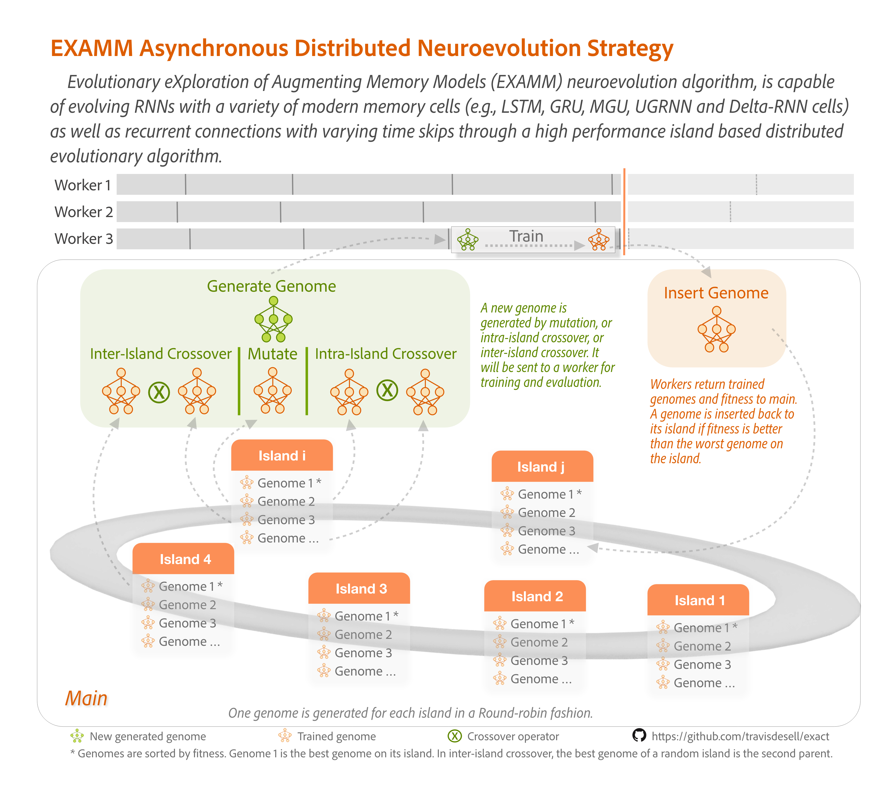

# Table of Contents

1. [EXAMM and EXA-GP Overview](#examm-and-exa-gp)
2. [Installation and Setup](#installation-and-setup)
3. [Quickstart](#quickstart)
4. [Managing Datasets](#managing-datasets)
5. [Running EXAMM and EXA-GP](#running-examm-and-exa-gp)
6. [Tracking and Managing Evolved Networks](#tracking-and-managing-evolved-networks)
7. [Using Evolved Neural Networks for Inference](#using-evolved-neural-networks-for-inference)


# EXAMM and EXA-GP Overview

EXAMM (Evolutionary eXploration of Augmenting Memory Models) is a neuroevolution (evolutionary neural architecture search) algorithm which automates the design and training of recurrent neural networks (RNNs) for time series forecasting. EXAMM uses a constructive evolutionary process which evolves progressively larger RNNs by a set of mutation and crossover operations. EXAMM is a fine-grained neuroevolution algorith, operating at the level of individual nodes and edges which allows for extremely efficient and minimal networks. It utilizes a library of various modern memory cells (LSTM, GRU, MGU, UGRNN, and Delta-RNN) [^examm_memory_cells] and can establish recurrent connections with varying time skips for improved learning and forecasting [^examm_deep_recurrent].  It also uses a Lamarckian weight inheritance strategy, allowing generated networks to re-use weights of their parents to reduce the amount of training by backpropagation required [^examm_lamarckian].

[^examm_memory_cells]: Alex Ororbia, AbdElRahman ElSaid, and Travis Desell. **[Investigating Recurrent Neural Network Memory Structures using Neuro-Evolution](https://dl.acm.org/citation.cfm?id=3321795).** <em>The Genetic and Evolutionary Computation Conference (GECCO 2019).</em> Prague, Czech Republic. July 8-12, 2019.

[^examm_deep_recurrent]: Travis Desell, AbdElRahman ElSaid and Alexander G. Ororbia. **[An Empirical Exploration of Deep Recurrent Connections Using Neuro-Evolution](https://www.se.rit.edu/~travis/papers/2020_evostar_deep_recurrent.pdf)**. The 23nd International Conference on the Applications of Evolutionary Computation (EvoStar: EvoApps 2020). Seville, Spain. April 15-17, 2020. <em>Best paper nominee</em>.

[^examm_lamarckian]: Zimeng Lyu, AbdElRahman ElSaid, Joshua Karns, Mohamed Mkaouer, Travis Desell. **[An Experimental Study of Weight Initialization and Lamarckian Inheritance on Neuroevolution](https://www.se.rit.edu/~travis/papers/2021_EvoStar_Weight_initialization.pdf).** *The 24th International Conference on the Applications of Evolutionary Computation (EvoStar: EvoApps 2021).*

EXAMM has since been extended to the Evolutionary Exploration of Augmenting Genetic Programs (EXA-GP) algorithm, which replaces the memory cells of EXAMM with basic genetic programming (GP) operations (e.g., sum, product, sin, cos, tanh, sigmoid, inverse).  EXA-GP has been shown to generate compact genetic programs (multivariate functions) for time series forecasting which can outperform the RNNs evolved by EXAMM while at the same time being more interpretable[^exagp][^exagp_min].

[^exagp]: Jared Murphy, Devroop Kar, Joshua Karns, and Travis Desell. **[EXA-GP: Unifying Graph-Based Genetic Programming and Neuroevolution for Explainable Time Series Forecasting](link).** *Proceedings of the Genetic and Evolutionary Computation Conference Companion.* Melbourne, Australia. July 14-18, 2024.

[^exagp_min]: Jared Murphy, Travis Desell. **[Minimizing the EXA-GP Graph-Based Genetic Programming Algorithm for Interpretable Time Series Forecasting](link).** *Proceedings of the Genetic and Evolutionary Computation Conference Companion.* Melbourne, Australia. July 14-18, 2024.

Implemented in C++, EXAMM and EXA-GP are designed for efficient CPU-based computation (which for time series forecasting RNNs are typically more performant than GPUs) and offers excellent scalability due to its asynchronous island based distributed strategy (see above) with repopulation events which prune evolutionary dead ends to improve perforance[^examm_islands]. They employ a distributed architecture where worker processes handle RNN training while a main process manages population evolution and orchestrates the overall evolutionary process.  This allows for better performance via either multithreaded execution or distributed execution on high performance computing clusters via the message passing interface (MPI).

[^examm_islands]: Zimeng Lyu, Joshua Karns, AbdElRahman ElSaid, Mohamed Mkaouer, Travis Desell. **[Improving Distributed Neuroevolution Using Island Extinction and Repopulation](https://www.se.rit.edu/~travis/papers/2021_EvoStar_Repopulation.pdf).** *The 24th International Conference on the Applications of Evolutionary Computation (EvoStar: EvoApps 2021).*


# Installation and Setup
EXAMM and EXA-GP have been designed to have a fairly minimal set of requirements, and we recommend using either OSX or Linux.  For Windows users, we recommend using Windows Subsystem for Linux (WSL) to run EXAMM or EXA-GP in a linux VM. EXAMM/EXA-GP use CMake to create a makefile for building (this can potentially also be used to make a visual studio project, however we have not tested this).

## OSX and Linux Setup
For OSX we recommend using [Homebrew](https://brew.sh) to handle installing packages, for Linux please use your package manager of choice. Installing all required libraries below (or their linux versions) should be sufficient to compile EXAMM/EXA-GP:

```bash
xcode-select --install
brew install cmake
brew install mysql
brew install open-mpi
brew install libtiff
brew install libpng
brew install clang-format
```

## Cluster Setup
The following is for internal use on RIT's high performance computing cluster, however if your own computing cluster utilizes [Spack](https://spack.io) you may find this useful.

```bash
# GCC (9.3)
spack load gcc/lhqcen5

# CMake
spack load cmake/pbddesj

# OpenMPI
spack load openmpi/xcunp5q

# libtiff
spack load libtiff/gnxev37
```

## Building
After the above libraries have been installed and/or loaded, compiling EXAMM/EXA-GP should be as simple doing the following within your root EXAMM directory.

```bash
mkdir build
cd build
cmake ..
make
```

# Quickstart

For quick start with example datasets using basic settings, the following scripts provide examples of running EXAMM on the coal benchmark datasets provided in this repository running either the multithreaded version or the MPI version.  For a deeper dive on EXAMM/EXA-GP's command line arguments please see the [Running EXAMM and EXA-GP](#running-examm-and-exa-gp) section.

## [Multithreaded Version](./scripts/base_run/coal_mt.sh)
```bash
# In the root directory:
sh scripts/base_run/coal_mt.sh
```

## [MPI Version](./scripts/base_run/coal_mpi.sh)
```bash
# In the root directory:
sh scripts/base_run/coal_mpi.sh
```

# Managing Datasets

EXAMM and EXA-GP are designed to use multivariate time series data as training and validation data. When EXAMM or EXA-GP generate a new recurrent neural network (RNN) or genetic program (GP), the RNN or GP is trained for a specified number of backpropagation epochs on the training data, and then the fitness of the RNN or GP is calculated by evaluating it using the validation data. Simple comma-separated value (CSV) files are used to represent th the training and validation data (examples can be found within the [datasets](./datasets) subdirectory of the project). The first row of the CSV file should contain the column headers (without a `#` character), and all columns should have numerical values as data. For example:

**file1.csv:**
```csv
a,b,c,d
0.5,0.2,0.1,0.2
0.8,0.1,0.3,0.5
...
0.9,-0.2,0.2,0.6
```

**file2.csv:**
```csv
a,b,c,d
0.7,-0.2,0.7,0.3
0.6,-0.1,0.5,0.4
...
0.4,0.3,-0.1,0.6
```

**file3.csv:**
```csv
a,b,c,d
-0.5,0.6,0.5,0.9
-0.8,0.7,-0.3,0.8
...
-0.9,-0.8,-0.3,0.3
```

Given three example files which can be used for training and evolving the networks (either RNNs or GPs) as well as validating their results to calculate the fitness.  These are a four column CSV files with the first column being named `a`, the second column being named `b` and so on. These column names can be used to specifiy which columns are used as inputs to the evolved networks.  The files used for training are specified with the `--training_filenames <str>+` command line option and the files used for validation are specified with the `--validation_filenames <str>+` command line option.  Similarly, the `--input_parameter_names <str>+` specify which columns are used as inputs to the networks and `--output_parameter_names <str>+` specify which columns are being predicted (i.e., the outputs of the networks). Note that the same columns can be used for both inputs and outputs.

As the networks evolved are used for time series forecasting, the `--time_offset <int>` command line option specifies how far in the future (how many rows) the network is predicting. So if `--time_offset 5` is specified the values from row 1 would be used to predict the values in row 6, the values in row 2 would be used to predict the values in row 7, and so on.  `--time_offset` can also be set to `0` to predict the input data, which can be useful for evolving auto-encoder like networks.

EXAAM and EXA-GP currently utilize unbatched stochastic gradient descent to train the evolved networks, so each training file specified is used as a sample which are randomly shuffled each epoch.  We have found however that while memory cell recurrent architectures are supposed to well handle long term time dependencies in practice this is not necessarily the case. It is possible to improve performance by dividing up input time series data into smaller sequences[^examm_coal]. The `--train_sequence_length <int>` command line option can be used to specify how many rows to slice each training file into (if they are not evenly divisible by this number the last slice will be the remaining rows of the file).

[^examm_coal]: Zimeng Lyu, Shuchita Patwardhan, David Stadem, James Langfeld, Steve Benson, and Travis Desell. **[Neuroevolution of Recurrent Neural Networks for Time Series Forecasting of Coal-Fired Power Plant Data](https://www.se.rit.edu/~travis/papers/2021_Gecco_NEWK_Work_Workshop_Zimeng.pdf)**. <em>ACM Workshop on NeuroEvolution@Work (NEWK@Work}, held in conjunction with ACM Genetic and Evolutionary Computation Conference (GECCO).</em> pp. 1735-1743. Lille, France. July 10-14, 2021.

If the training and validation CSVs are not already normalized, they can be normalized with the optional `--normalize <str>` argument which can either be `min_max` which will calculate the min and max value for each column in the training data, and use those values to normalize the data:

$$x = \frac{x - training_{min}}{training_{max} - training_{min}}$$

Or can be `avg_std_dev` which does computes average and standard deviation of the training data columns and normalizes the data (i.e., z-score normalization):

$$x = \frac{x - training_{avg}}{training_{std}}$$

Putting this all together, given the following command line options and the above example files, we can run the multithreaded version of EXAMM (with `...` being other options described in the upcoming section):

```
./multithreaded/examm_mt --training_filenames file1.csv file2.csv --validation_filenames file3.csv --input_parameter_names a b d --output_parameter_names c d --time_offset 1 --train_sequence_length 50 --normalize avg_std_dev ...
```

Note that the min/max or avg/std dev values from the training data are used to normalize the validation data.

This will run EXAMM with `file1.csv` and `file2.csv`, each split up into segments of at most 50 rows, to train the evolved networks and calculate the fitness of those networks using `file3.csv`. Each file will be z-score normalized based on the training files. The values in columns `a`, `b` and `d` will be used to predict the values in columns `c` and `d` in the next row (a time offset of 1).

# Running EXAMM and EXA-GP

Given the above options for loading and using training and validation data, we can explore the various options for running EXAMM and EXA-GP. The library also contains an implementation which utilizes NEAT speciation, for comparison purposes, which also serves as a memetic (backprop enabled) version of NEAT[^neat] with the advanced node level mutation operations of EXAMM.

[^neat]: Kenneth Stanley and Risto Miikkulainen. **[Evolving neural networks through augmenting topologies.](https://direct.mit.edu/evco/article-pdf/10/2/99/1493254/106365602320169811.pdf)** <em>Evolutionary Computation 10.2</em>(2002): 99-127.

## Evolution Strategy Hyperparameters

The following command line options control the neuroevolution search process itself.

* `--max_genomes <int>` specifies how many genomes (RNNs or GPs) to evaluate before terminating the run. Note that EXAMM/EXA-GP use an asynchronous strategy with steady state populations so there are no explicit generations.

* `--min_recurrent_depth <int>` and `--max_recurrent_depth <int>` specify the possible range of time skip values for recurrent connections added to the evolved networks.  Default values are 1 and 10. Adding in deeper recurrent connections has been shown to improve forecasting performance, and in some cases even outperform memory cells[^examm_deep_recurrent].

* `--possible_node_types <str>+` specifies the options for selecting which node types can be added to networks during the evolution process. Default possible node types are the default for EXAMM (`simple`, `jordan`, `elman`, `ugrnn`, `mgu`, `gru`, `delta`, and `lstm` (please see [^examm_memory_cells] for more details on these node types). EXA-GP can be enabled by instead using `sigmoid`, `tanh`, `sum`, `multiply`,`inverse`, `sin` and `cos` as possible node types; and the better peforming EXA-GP-MIN can be enabled with the `_gp` options: `sigmoid_gp`, `tanh_gp`, `sum_gp`, `multiply_gp`, `inverse_gp`, `sin_gp` and `cos_gp` for the possible node types (for more details on their implementation see [^exagp][^exagp_min]).

* `--speciation_method <str>` specifies if genomes in the population should be speciated into islands (using `island`) or with NEAT's speciation strategy (using `neat`). Each of these come with their own set of parameters (see subsections below):

### Island Speciation

* `--number_islands <int>` specifies how many islands should be used to perform the search, with a minimum of 1. If only 1 island is specified this operates the same as a single population version.
* `--island_size <int>` specifies the maximum number of genomes each island will hold for its population.
* `--extinction_event_generation_number <int>` specifies how frequently to perform island extinction if the value (N) is greater than 0. After every N inserted genomes `islands_to_exterminate` islands selected by `island_ranking_method` will have their genomes removed and these will be repopulated as specfied by the `repopulation_method`. See [^examm_islands] for full details and an examination of this methodology.
* `--islands_to_exterminate <int>` specifies how many islands to repopulate in an extinction event.
* `--island_ranking_method <str>` currently only allows `EraseWorse` which will have extinction happen on the island(s) with the lowest fitness of the island's best individual.
* `--repopulation_method <str>` allows for `bestparents`, `randomparents`, `bestgenome` and `bestisland`:
    * `bestparents` selects 2 parents randomly from the best parents of other (non-repopulating) islands to perform crossover on to generate new genomes to repopulate islands.
    * `randomparents` selects 2 parents randomly from the genomes of all other non-repopulating islands to perform crossover on to generate new genomes to repopulate islands.
    * `bestgenome` selects the global best genome and performs mutations on it to repopulate islands.
    * `bestisland` selects the best island and repopulates islands by performing a mutation on each genome in the best island.
* `--num_mutations <int>` specifies how many mutation operations to perform when generating a child genome by mutation.
* `--repeat_extenction` if specified, if an island is repopulated it will not be repopulated until 5 other extinction events have passed. This prevents the same island from being repopulated over and over.

### NEAT Speciation

* `--species_threshold <float>`
* `--fitness_threshold <float>`
* `--neat_c1 <float>`
* `--neat_c2 <float>`
* `--neat_c3 <float>`

If `neat` is selected as the speciation method, the following hyperparameters from the NEAT paper[^neat] can be specified. Given the following equation, where $E$ is the number of excess genes, $D$ is the number of disjoint genes, $N$ is the genome size factor (the number of genes in the larger genome), `neat_c1` is the $c1$ constant, `neat_c2` is the $c2$ constant and `neat_c3` is the $c3$ constant:

$$\delta = \frac{c_1E}{N} + \frac{c_2D}{N} + c_3 * \overline{W}$$

If $\delta$ is less than the `species_threshold`, $\delta_t$ or the compatability threshold in the NEAT paper, two genomes will be considered in the same species. Species adjusted fitnesses, $f'_i$ are computed as follows:

$$f'_i = \frac{f_i}{\Sigma^n_{j \eq 1} sh(\delta(i, j))}$$

Where $sh$ is set to 0 when the distance $\delta(i,j)$ is above the `fitness_threshold`. Using the above hyperparameters genomes will be placed into species as done in the NEAT algorithm.

## Weight Initialization

* `--weight_initialize`
* `--weight_inheritance`
* `--mutated_component_weight`

## Training Hyperparameters

* `--bp_iterations`

* `--learning_rate`
* `--high_threshold`
* `--low_threshold`

* `--weight_update`
    * `vanilla`
    * `momentum` uses `--mu`
    * `nesterov`  uses `--mu`
    * `adagrad` uses `--eps`
    * `rmsprop` uses `--eps` `--decay_rate`
    * `adam` uses `--eps`, `--beta1`, `--beta2`
    * `adam-bias` uses `--eps`, `--beta1`, `--beta2`


5. [Tracking and Managing Evolved Networks](#tracking-and-managing-evolved-networks)

* `--output_directory`

6. [Using Evolved Neural Networks for Inference](#using-evolved-neural-networks-for-inference)


# Selected Publications

EXAMM has been at the forefront of neuroevolution research, making significant contributions to both algorithmic advancement and real-world applications. Our work spans multiple domains including financial forecasting, industrial production system management, and algorithm optimization. Through continuous development and innovation, we've published extensively on improving neuroevolution techniques, enhancing RNN architectures, and solving complex time series forecasting challenges. Our ongoing research continues to push the boundaries of what's possible with evolutionary neural architecture search. 

1. Zimeng Lyu, Devroop Kar, Matthew Simoni, Rohaan Nadeem, Avinash Bhojanapalli, Hao Zhang and Travis Desell. **[Evolving RNNs for Stock Forecasting: A Low Parameter Efficient Alternative to Transformers](link).** *The 28th International Conference on the Applications of Evolutionary Computation (EvoStar: EvoApps 2025).* Trieste, Italy. April 23-25, 2025.

2. Devroop Kar, Zimeng Lyu, Alexander G. Ororibia, Travis Desell, and Daniel Krutz. **[Enabling An Informed Contextual Multi-Armed Bandit Framework For Stock Trading With Neuroevolution](link).** *Proceedings of the Genetic and Evolutionary Computation Conference Companion.* Melbourne, Australia. July 14-18, 2024.

3. Jared Murphy, Devroop Kar, Joshua Karns, and Travis Desell. **[EXA-GP: Unifying Graph-Based Genetic Programming and Neuroevolution for Explainable Time Series Forecasting](link).** *Proceedings of the Genetic and Evolutionary Computation Conference Companion.* Melbourne, Australia. July 14-18, 2024.

4. Jared Murphy, Travis Desell. **[Minimizing the EXA-GP Graph-Based Genetic Programming Algorithm for Interpretable Time Series Forecasting](link).** *Proceedings of the Genetic and Evolutionary Computation Conference Companion.* Melbourne, Australia. July 14-18, 2024.

5. Zimeng Lyu, Amulya Saxena, Rohaan Nadeem, Hao Zhang, Travis Desell. **[Neuroevolution Neural Architecture Search for Evolving RNNs in Stock Return Prediction and Portfolio Trading](link).** *arXiv.* 2024.

6. Aditya Shankar Thakur, Akshar Bajrang Awari, Zimeng Lyu, and Travis Desell. **[Efficient Neuroevolution using Island Repopulation and Simplex Hyperparameter Optimization](link).** *The 2023 IEEE Symposium Series on Computational Intelligence (SSCI 2023).* Mexico City, Mexico. December 5-8, 2023.

7. Amit Dilip Kini*, Swaraj Sambhaji Yadav*, Aditya Shankar Thakur, Akshar Bajrang Awari, Zimeng Lyu, and Travis Desell. **[Co-evolving Recurrent Neural Networks and their Hyperparameters with Simplex Hyperparameter Optimization](link).** *The Genetic and Evolutionary Computation Conference Companion (GECCO '23 Companion).* Lisbon, Portugal. July 15–19, 2023. *Indicates equal contribution.

8. Joshua Karns and Travis Desell. **[Local Stochastic Differentiable Architecture Search for Memetic Neuroevolution Algorithms](link).** *The Genetic and Evolutionary Computation Conference Companion (GECCO '23 Companion).* Lisbon, Portugal. July 15–19, 2023.

9. Michael Kogan, Joshua Karns and Travis Desell. **[Self-Adaptation of Neuroevolution Algorithms using Reinforcement Learning](link).** *The 25th International Conference on the Applications of Evolutionary Computation (EvoStar: EvoApps 2021).* Madrid, Spain. April 20-22, 2022.

10. Zimeng Lyu, Shuchita Patwardhan, David Stadem, James Langfeld, Steve Benson, Travis Desell. **[Neuroevolution of Recurrent Neural Networks for Time Series Forecasting of Coal-Fired Power Plant Data](link).** *The Genetic and Evolutionary Computation Conference (GECCO 2021).*

11. Joshua Karns and Travis Desell. **[Improving the Scalability of Distributed Neuroevolution Using Modular Congruence Class Generated Innovation Numbers](link).** *The 1st Workshop on Evolutionary Algorithms and High Performance Computing (EAHPC), held in conjunction with ACM Genetic and Evolutionary Computation Conference (GECCO).* Lille, France. July 10-14, 2021.

12. Zimeng Lyu, AbdElRahman ElSaid, Joshua Karns, Mohamed Mkaouer, Travis Desell. **[An Experimental Study of Weight Initialization and Lamarckian Inheritance on Neuroevolution](link).** *The 24th International Conference on the Applications of Evolutionary Computation (EvoStar: EvoApps 2021).*

13. Zimeng Lyu, Joshua Karns, AbdElRahman ElSaid, Mohamed Mkaouer, Travis Desell. **[Improving Distributed Neuroevolution Using Island Extinction and Repopulation](link).** *The 24th International Conference on the Applications of Evolutionary Computation (EvoStar: EvoApps 2021).*

14. AbdElRahman ElSaid, Joshua Karns, Zimeng Lyu, Daniel Krutz, Alexander Ororbia, Travis Desell. **[Improving Neuroevolutionary Transfer Learning of Deep Recurrent Neural Networks through Network-Aware Adaptation](link).** *The Genetic and Evolutionary Computation Conference (GECCO 2020).*

15. AbdElRahman ElSaid, Joshua Karns, Zimeng Lyu, Daniel Krutz, Alexander G. Ororbia, Travis Desell. **[Neuro-Evolutionary Transfer Learning through Structural Adaptation](link).** *The 23rd International Conference on the Applications of Evolutionary Computation (EvoStar: EvoApps 2020).*

16. Alex Ororbia, AbdElRahman ElSaid, and Travis Desell. **[Investigating Recurrent Neural Network Memory Structures using Neuro-Evolution](https://dl.acm.org/citation.cfm?id=3321795).** *The Genetic and Evolutionary Computation Conference (GECCO 2019).* Prague, Czech Republic. July 8-12, 2019.

17. AbdElRahman ElSaid, Steven Benson, Shuchita Patwardhan, David Stadem and Travis Desell. **[Evolving Recurrent Neural Networks for Time Series Data Prediction of Coal Plant Parameters](https://link.springer.com/chapter/10.1007/978-3-030-16692-2_33).** *The 22nd International Conference on the Applications of Evolutionary Computation (EvoStar: EvoApps 2019).* Leipzig, Germany. April 24-26, 2019.

18. Travis Desell, AbdElRahman ElSaid and Alexander G. Ororbia. **[An Empirical Exploration of Deep Recurrent Connections Using Neuro-Evolution](https://www.se.rit.edu/~travis/papers/2020_evostar_deep_recurrent.pdf)**. The 23nd International Conference on the Applications of Evolutionary Computation (EvoStar: EvoApps 2020). Seville, Spain. April 15-17, 2020. <em>Best paper nominee</em>.


# Archived: EXACT Project

EXACT (Evolutionary eXploration of Augmenting Convolutional Topologies) was a predecessor project focused on evolving convolutional neural networks. While the source code and documentation for EXACT is still available in this repository, setting it up requires specific configurations and dependencies. If you're interested in using EXACT, please contact us for instruction on setup and implementation. We're happy to help you get started with the system.


---
© 2025 Distributed Data Science Systems Lab (DS2L), Rochester Institute of Technology. All Rights Reserved.

